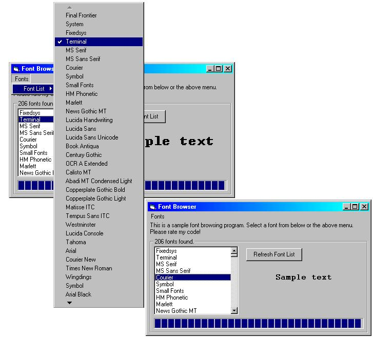

## Font Browser \- With preview text\!

### Description

This program will grab all screen fonts avaliable, and add them all to a list, and to a menu! So you can select the font from a menu! Also, when a font has been selected, the 'Sample Text' font will change to the font selected. So you can preview fonts before you use them! And the list and menu's are in sync. So if you select something from the menu, it gets selected in the font list! Please vote for me!
 
### More Info
 

             |
---                |---
**Submitted On**   |2000-05-07 21:25:48
**By**             |[Andrew A](https://github.com/Planet-Source-Code/PSCIndex/blob/master/ByAuthor/andrew-a.md)
**Level**          |Beginner
**User Rating**    |4.8 (19 globes from 4 users)
**Compatibility**  |VB 4\.0 \(32\-bit\), VB 5\.0, VB 6\.0
**Category**       |[Miscellaneous](https://github.com/Planet-Source-Code/PSCIndex/blob/master/ByCategory/miscellaneous__1-1.md)
**World**          |[Visual Basic](https://github.com/Planet-Source-Code/PSCIndex/blob/master/ByWorld/visual-basic.md)
**Archive File**   |[CODE\_UPLOAD5563572000\.zip](https://github.com/Planet-Source-Code/andrew-a-font-browser-with-preview-text__1-7917/archive/master.zip)

